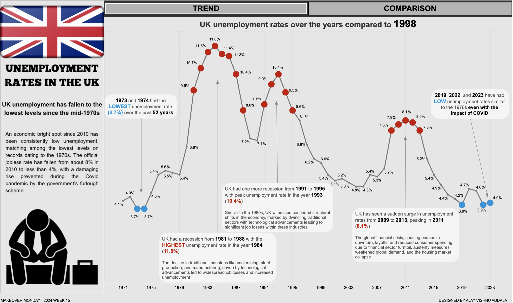

# Unemployment Rate Analysis in the UK Dashboard

## Overview

This Tableau dashboard provides an in-depth analysis of the unemployment rate in the UK over the years. The main visualization is a line chart depicting the trend of unemployment rates with annotations highlighting the reasons for peaks in unemployment rates. Additionally, the dashboard features a comparison plot that allows viewers to select a specific year for comparison with other years. A year filter is also provided, allowing viewers to focus on particular year ranges.

## Dashboard Snapshot

## Dashboard Link

Explore the interactive Tableau dashboard [here](https://public.tableau.com/views/UnemploymentRatesintheUKMOM2024Week15/Unemp_trend?:language=en-US&:sid=&:display_count=n&:origin=viz_share_link).

## Data Source

The data used for this analysis was sourced from Makeover Monday. It includes historical data on the UK's unemployment rate and information on factors contributing to fluctuations in unemployment rates.

## Dashboard Interactivity

- **Line Chart**: View the trend of unemployment rates over the years, with annotations explaining the reasons behind peaks in unemployment rates.
- **Comparison Plot**: Select a specific year to compare its unemployment rate with other years, providing valuable insights into trends and fluctuations.
- **Year Filter**: Filter the dashboard to focus on specific year ranges, allowing for a more granular analysis of unemployment trends.

## Insights

- The line chart highlights the overall trend of unemployment rates in the UK, with annotations providing context for significant peaks.
- The comparison plot allows for a detailed examination of unemployment rates for a chosen year compared to other years, aiding in identifying patterns and anomalies.
- Utilizing the year filter lets viewers focus on specific periods, facilitating targeted analysis and trend identification.

